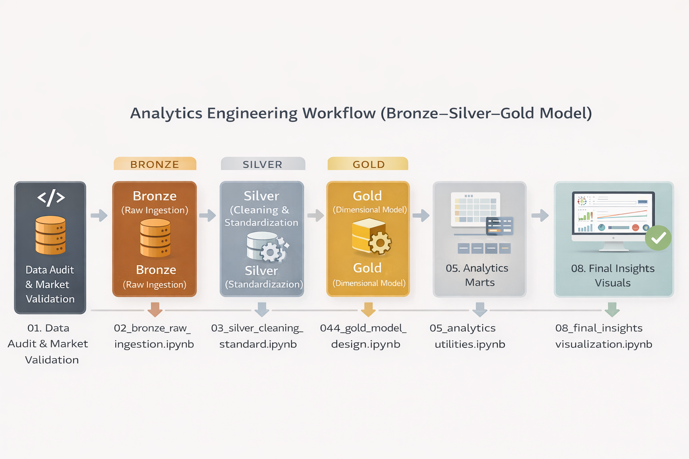
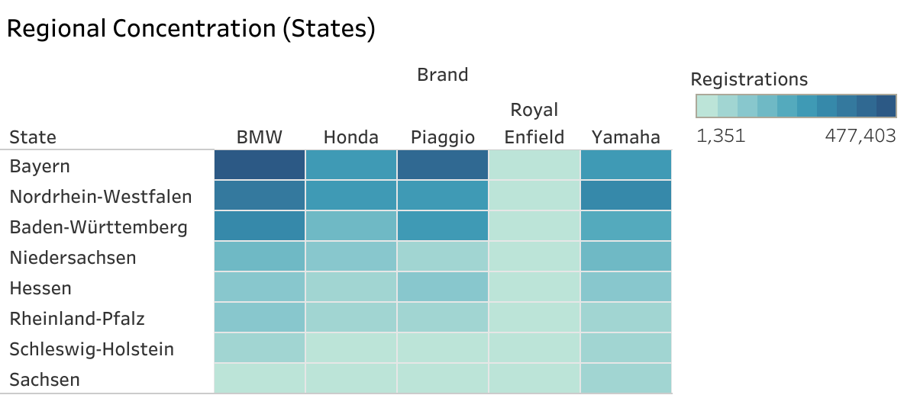

# 🏍️ German Motorcycle Market Analysis (2023–2025)
### Royal Enfield Competitive Growth | Analytics Engineering + Tableau Dashboard

End-to-end analytics engineering project analyzing the **German motorcycle registration market** and benchmarking **Royal Enfield’s growth** against major manufacturers such as BMW, Yamaha, Honda, Suzuki, and Piaggio.

---

## 📊 Dashboard Preview


📌 Key Insight: Royal Enfield recorded the highest YoY growth (+17.65%) despite holding only ~0.35% market share in Germany.


---

## 🎯 Business Questions Answered

- Who dominates the German motorcycle market by registration share?
- How concentrated is the industry (Pareto 80/20 structure)?
- Which brands are growing fastest year-over-year?
- Where are registrations geographically clustered across German states?
- How does Royal Enfield compare against established competitors?

---

## ⚙️ Analytics Engineering Workflow (Bronze–Silver–Gold)

This project follows a modern analytics pipeline:

- **Bronze**: Raw ingestion  
- **Silver**: Cleaning & standardization  
- **Gold**: Dimensional modeling + analytics marts  
- **Tableau**: Executive dashboards & insights  



---

## 📈 Key Tableau Insights

### Market Leaders (Share %)


---

### Market Concentration (Pareto Analysis)


---

### Fastest Growing Brands (YoY Growth)
Royal Enfield recorded the strongest YoY growth (+17.65%) despite holding a small market share.


---

### Regional Concentration by State


---

### Royal Enfield vs Market Leaders (2024 Benchmark)


---

## 📂 Repository Structure

```bash
notebooks/   # Data audit → Bronze → Silver → Gold pipeline
docs/        # Workflow diagram + documentation
tableau/     # Tableau dashboard + screenshots


## 🛠️ Tools & Skills Demonstrated

- Python (Pandas, KPI engineering)
- Bronze–Silver–Gold analytics workflow
- Dimensional modeling (Facts + Dimensions)
- Market share & YoY growth analysis
- Tableau dashboard storytelling
- Competitive benchmarking & regional segmentation

---

## 🔗 Links

- Tableau Public Dashboard: https://public.tableau.com/app/profile/kirandarshak/viz/MotorcycleMarketAnalysis/Dashboard1
- LinkedIn: https://www.linkedin.com/in/kirandarshak
